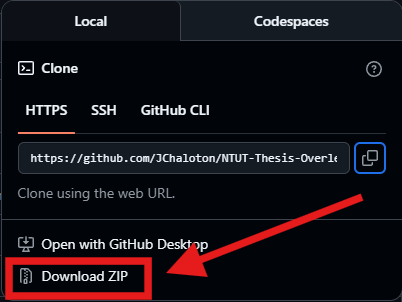

# NTUT-Thesis-Overleaf-ENG-Template
Originally based on the [NTUT Thesis Template](https://github.com/c1ydehhx/NTUT-Thesis-Template).

### What's new:
- Compatible with Overleaf
- Added English instructions
- Added a longtable example
- Added a subfigure example

### Usage
Either clone this repo using 
```
git clone https://github.com/JChaloton/NTUT-Thesis-Overleaf-ENG-Template.git
```
or simply click `Download ZIP`


### Documents

- The `ntut-labels.tex` has all the parameters for the front page, such as department name, title, degree, student name, advisor name, etc.

- The `page/abstract.tex` and `page/abstract-en.tex` contain the content for your abstracts; the Chinese version is optional.

- The `main.tex` compiles and includes other pages, such as the abstract, acknowledgments, table of contents, thesis chapters, and references.

- The `chapter/` folder contains all of your thesis chapters. Feel free to add as many chapters as you need.

- The `static-page/signpage.pdf` is a completed 'Oral Defense Committee Signature Form' with all committee signatures.


### Special thanks

This repo is an English, Overleaf-compatible modification of the [NTUT Thesis Template](https://github.com/c1ydehhx/NTUT-Thesis-Template):

- National Taipei University of Technology, Department of Computer Science and Information Engineering, Professor 孫勤昱

- National Taipei University of Technology, Department of Computer Science and Information Engineering, Professor 陳昱圻

- and all the contributors